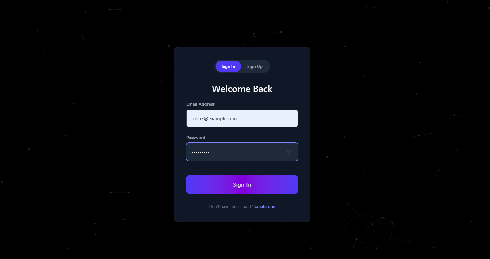
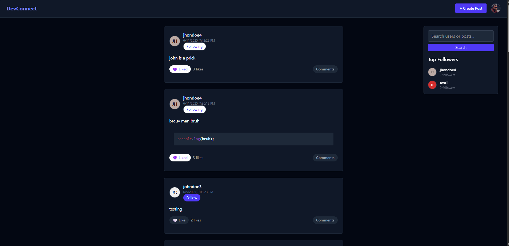
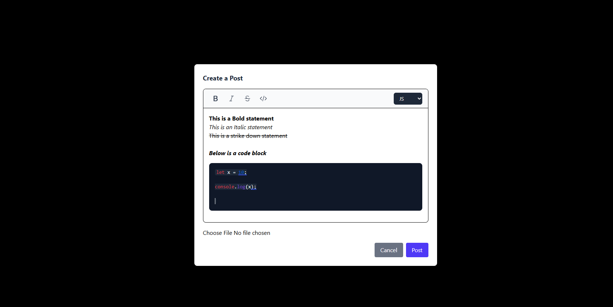
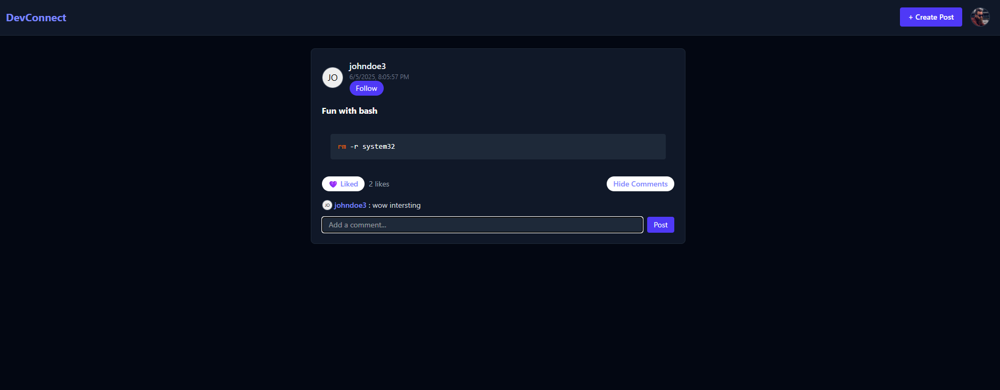
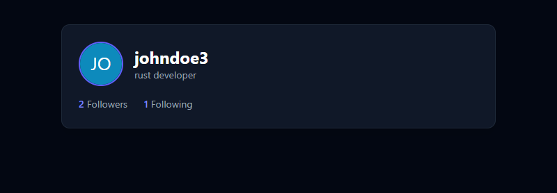
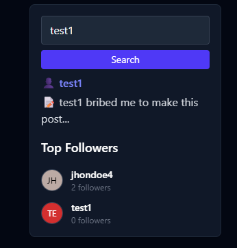

# DevConnect

DevConnect is a developer-focused social platform where users can share posts (with code support), like, comment, and follow other developers. It emphasizes backend architecture, scalability, and clean design patterns using Spring Boot and Elasticsearch.

---

## 🚀 Features

- **User Authentication (JWT)** – Signup & Login with secure token-based auth
- **Create & View Posts** – With optional code snippets and image uploads
- **Like / Unlike Posts** – Users can like or unlike any post
- **Comment System** – Paginated comments per post
- **Follow / Unfollow Users** – Build a dev following
- **User Profiles** – View public profiles with follower/following counts
- **Infinite Scroll** – Efficient pagination support on posts feed
- **Full-text Search** – Search users and posts via Elasticsearch 8.x
- **Auto-highlight Code** – Code blocks in posts are syntax highlighted
- **MVC Pattern** – Clean layered architecture with DTOs, services, and repositories

---

## ⚙️ Tech Stack

### Backend
- **Spring Boot 3** – REST APIs
- **Spring Security** – JWT-based authentication
- **Spring Data JPA** – ORM with PostgreSQL
- **Elasticsearch 8.11.1** – Full-text search
- **Docker** – For running Elasticsearch locally
- **Lombok** – Reduces boilerplate
- **ModelMapper** – DTO mapping
- **Maven** – Dependency management

### Frontend
- **React.js** – Functional components
- **Tailwind CSS** – UI styling
- **Highlight.js** – Code block syntax highlighting
- **React Intersection Observer** – Infinite scrolling

---

## 📸 Screenshots

### 📝 Sign Up


### 🏠 Home Feed


### ✍️ Create Post


### 📬 Post Detail


### 👤 User Profile


### 🔍 Search Result



---

## 🧪 How to Run Locally

### 1. Clone the Repository
```bash
git clone https://github.com/yourusername/devconnect.git
cd devconnect
```
### 2. Backend Setup (Spring Boot)
```bash
cd backend
./mvnw clean install
```
### 3. Run Elasticsearch via Docker
```bash
docker run -d --name elasticsearch \
 -p 9200:9200 \
 -e "discovery.type=single-node" \
 -e "xpack.security.enabled=false" \
 docker.elastic.co/elasticsearch/elasticsearch:8.11.1
```
(use back ticks instead of \ if not working)

### 4. Start Backend
```bash
./mvnw spring-boot:run
```

### 5. Frontend Setup (React)
```bash
cd frontend
npm install
npm run dev
```

### 📂 Folder Structure

backend/  
├── controller/  
├── dto/  
├── model/  
├── repository/  
├── service/  
├── security/  
└── config/  

### 📄 Sample Post JSON (for testing via Postman)

POST /posts
```
Authorization: Bearer <your_token>
{
  "content": "<p>Hello world</p><pre><code class='language-js'>console.log('hi')</code></pre>",
  "imageUrl": "https://example.com/image.jpg"
}
```

### 💡 Future Improvements

    Real-time notifications with WebSockets

    Admin dashboard

